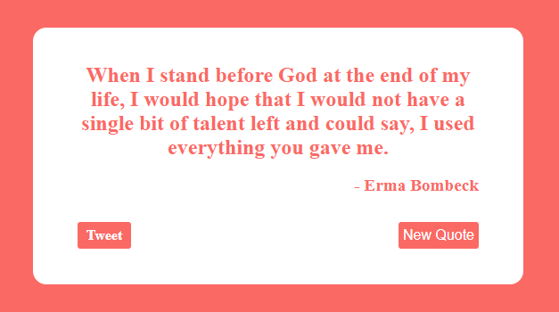
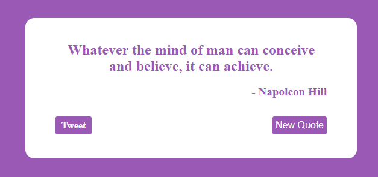

# Random Quote Machine

Displays a random quote and who said it from an API, with a button to get new quotes and to tweet the quote. 

## Contents

- [Features](#features)
- [Installation](#installation)
- [Functionality and Screenshots](#functionality-and-screenshots)
- [Credits](#credits)

## Features

- View quotes said by famous figures around the world.
- Get a new quote at the press of a button.
- Tweet the quote that is displayed.

## Installation

In the project directory, you can run:

### `npm start`

Runs the app in the development mode.\
Open [http://localhost:3000](http://localhost:3000) to view it in your browser.

The page will reload when you make changes.\
You may also see any lint errors in the console.

### `npm test`

Launches the test runner in the interactive watch mode.\
See the section about [running tests](https://facebook.github.io/create-react-app/docs/running-tests) for more information.

### `npm run build`

Builds the app for production to the `build` folder.\
It correctly bundles React in production mode and optimizes the build for the best performance.

The build is minified and the filenames include the hashes.\
Your app is ready to be deployed!

See the section about [deployment](https://facebook.github.io/create-react-app/docs/deployment) for more information.

### `npm run eject`

**Note: this is a one-way operation. Once you `eject`, you can't go back!**

If you aren't satisfied with the build tool and configuration choices, you can `eject` at any time. This command will remove the single build dependency from your project.

Instead, it will copy all the configuration files and the transitive dependencies (webpack, Babel, ESLint, etc) right into your project so you have full control over them. All of the commands except `eject` will still work, but they will point to the copied scripts so you can tweak them. At this point you're on your own.

You don't have to ever use `eject`. The curated feature set is suitable for small and middle deployments, and you shouldn't feel obligated to use this feature. However we understand that this tool wouldn't be useful if you couldn't customize it when you are ready for it.

## Functionality and Screenshots

*Random Quote Machine Examples*

Two examples of quotes. By clicking the "New Quote" button, various colours will change together for each new quote.
- The quotes are grabbed from a json, and clicking new quote will randomly pick one of these quotes alongside who said the quote.
- The quote with the person who said it, can be tweeted with the tweet button.
- Each time a new quote is grabbed, the background color of the website will change, as well as the text colours and the colour of the buttons.

## Credits

### Tools

- JavaScript
- React
- SCSS
- HTML

[Back to Top](#contents)
